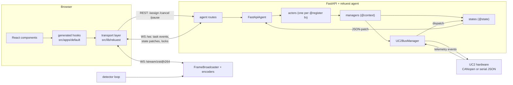
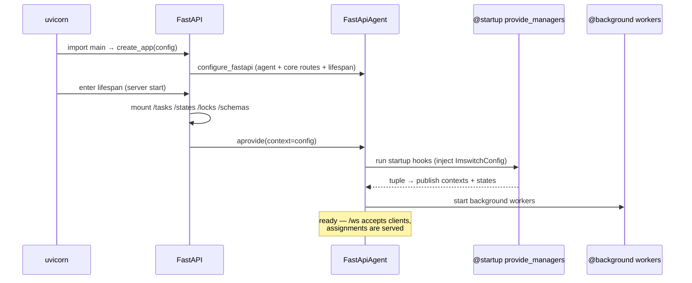

# newswitch Architecture & Developer Guide

*How the backend, rekuest-next, and the frontend fit together. Written against
rekuest-next 2.x as vendored in `backend/.venv` (2026-07). File references are
relative to the repo root.*

---

## 1. The big picture

newswitch is a FastAPI app whose entire functional surface is managed by a
**rekuest-next agent** embedded in the server. Nothing in the backend defines
REST endpoints for microscope features by hand — instead:

- **functions** decorated with `@register` become remotely callable **actions**,
- **data classes** decorated with `@state` become **reactive shared state**
  that is pushed to every browser as JSON-patches,
- **service classes** marked with `@context` (the "managers") are
  **dependency-injected** into those functions by type annotation,
- the frontend **generates typed React hooks** from the running backend's
  schema endpoints, so UI code never hand-writes API calls.



---

## 2. rekuest-next concepts, one by one

### 2.1 Agent and actors (the docstring, decoded)

rekuest uses the classic **distributed actor model**. Translated to newswitch:

- The **Agent** (`FastApiAgent`, created by `configure_fastapi` in
  `backend/newswitch/app.py:create_app`) is the *runtime container* for the
  whole app. It does not do microscope work itself. It owns:
  - `contexts: dict` — the live manager instances (everything `@context`),
  - `states: dict` — the live state instances (everything `@state`), each with
    a revision counter and a serialized ("shrunk") copy,
  - `locks: dict` — named task locks (e.g. `stage_position`),
  - the **implementation map** — one entry per `@register`ed function,
  - the collected `@startup` hooks and `@background` workers,
  - all running **assignments** (tasks) and the actors executing them,
  - a SQLite sink/retriever (`agent_data.db`) recording task history
    (that's what the frontend `/replay` page reads).
- An **actor** is the execution vehicle for one implementation. When a client
  *assigns* a task ("run `move_stage` with these args"), the agent routes the
  assignment to the actor for that implementation, which runs the function
  (sync functions in a worker thread via koil, async ones on the loop) and
  reports lifecycle events back (`STARTED`, `PROGRESS`, `YIELD`, `PAUSED`,
  `CANCELLED`, `COMPLETED`, `FAILED`).
- **Guardian vs non-guardian actors**: actors the agent spawns directly (one
  per registered implementation) are "guardian" actors; an actor may itself
  call other actions (`acall` inside a function body), spawning subordinate
  actors whose lifetime it owns. That's the "hierarchical structure" the
  docstring describes. In newswitch you mostly interact with the first level.

In upstream Arkitekt, the agent connects out to an arkitekt server and receives
assignments from there. In newswitch, the **FastAPI contrib** replaces that
transport: the agent lives inside uvicorn and browsers talk to it directly over
`/ws` + a few REST routes. Same model, no external server.

### 2.2 `AppContext` and `@app_context`

`rekuest_next.agents.base.AppContext` is nothing more than a **marker
protocol** (a class with one attribute, `__rekuest_app_context__`). The
`@app_context` decorator stamps that attribute onto your class. That's it —
no behavior.

Its purpose: the object you pass as `app_context=` into `configure_fastapi`
(newswitch passes `ImswitchConfig`) travels into `agent.aprovide(context=...)`
and becomes **injectable by type** into hooks and registered functions. That's
why `provide_managers(app_context: ImswitchConfig)` receives the config: the
parameter's *type annotation* is matched against the app-context class. Think
of it as the DI slot reserved for "the configuration of this deployment".

### 2.3 `@startup` — the composition root

```python
@startup
async def provide_managers(app_context: ImswitchConfig) -> Tuple[FrameBroadcaster, UC2BusManager, ..., StageState, ...]:
```

Startup hooks run **once, when the agent boots** (inside `aprovide`, before
anything is callable). Two pieces of magic, both driven purely by type
annotations:

1. **Parameter inspection** (the "app-context, state, and context
   dependencies"): each parameter is matched by its annotated type against
   (a) the app-context class, (b) already-published `@state` classes,
   (c) already-published `@context` classes. Matching objects are injected.
2. **Return annotation → publication**: the `Tuple[...]` return annotation
   tells the agent what each returned object *is*. Objects whose class/protocol
   is `@context` go into `agent.contexts`; objects whose class is `@state` go
   into `agent.states` (serialized, revision 0, immediately subscribable).

So `provide_managers` is the **composition root**: everything it returns is
"published for the rest of the agent lifecycle" and becomes injectable into
every `@register`/`@background` function. If you build a new manager and forget
to add it to both the return *value* and the return *annotation*, injection
will fail with `StateRequirementsNotMet` at call time.

**context dependency** = "give me the live manager instance of this type"
(e.g. `stage: StageManager`). **state dependency** = "give me the live shared
state instance" (e.g. `state: StageState`). Contexts are never serialized;
states are.

### 2.4 `@register` — actions

Any function becomes a remotely callable action:

```python
@register(locks=["stage_position"], optimistics=[...])
def move_stage(stage: StageManager, x: float | None = None, ...) -> None: ...
```

- Parameters that are contexts/states are injected (invisible to callers);
  everything else becomes the action's *argument schema* (a "port"), which is
  what the frontend codegen turns into a zod schema.
- `locks=[...]` serializes conflicting actions and surfaces "locked" to the UI.
- `optimistics=[...]` describes how the UI should *predict* the state change
  before the backend confirms (instant slider/position feedback).
- Inside the body you can call `progress(pct, msg)` and `pausepoint()`
  (from `rekuest_next`) — that's what powers the live progress bar and the
  pause/step buttons.
- Registration happens at **import time** into the *default app registry* —
  which is why `app.py` imports `newswitch.registers.uc2` and the routines
  for their side effects.

### 2.5 `@background` — daemons

`@background` functions are long-running workers started right after the
startup hooks (async ones run on the event loop, sync ones in a dedicated
thread). They use the same injection: `run_uc2_bus(uc2_bus: UC2BusManager)`
gets the live bus. newswitch has three: the detector acquisition loop, the UC2
bus connection pump, and the UC2 event → state dispatcher.

### 2.6 The four class decorators

| Decorator | From | What it does |
|---|---|---|
| `@context` | `rekuest_next.agents.context` | Marks a class (usually a `Protocol`) as an **injectable service** ("manager"). Optionally declares `locks=[...]` that all its users share. Stores only marker attributes — no wrapping. |
| `@state` | `rekuest_next.state.decorator` | The heavy one: introspects the class into a **state schema** (ports per field), registers it, and rewrites the class so instances are *evented*: every `setattr` (1) checks `required_locks` are held (via `acquired_locks(...)`), (2) applies the change, (3) publishes a JSON-patch with a new revision to all subscribers. |
| `@model` | `rekuest_next` | Marks a dataclass as a **serializable data structure** so it can appear inside action arguments/returns and state fields (it gets a port representation). Used for config/value objects (`StageConfig`, `Illumination`, `UC2CanBusConfig`, …). No reactivity. |
| `@runtime_checkable` | Python stdlib `typing` | Not rekuest at all — allows `isinstance(obj, SomeProtocol)` structural checks, which the tests use (`isinstance(bus, UC2BusManager)`). |

### 2.7 The app registry and bloks

`get_default_app_registry()` returns the global **AppRegistry** — the
accumulator for everything above (implementations, state schemas, locks,
bloks). `@register` writes into it implicitly; `registry.register(fn)` is the
explicit spelling used for the routines:

```python
default_app_registry.register(acquire_multidimensional_acquisition)
default_app_registry.register(scan_region)
```

You can register **any function** whose non-injected parameters are
serializable types — that's how a new "app" (in the ImSwitch sense) gets its
backend surface.

`register_blok(name, jsx(...))` is different: it ships a **server-defined UI
fragment** — a JSX-like DSL parsed on the backend, sent to the frontend via the
schema endpoints, and rendered there. Bloks can bind to states
(`@self.ObjectiveState.mounted_lenses`), loop (`<foreach>`), and invoke actions
(`onClick="@self.switch_objective(lens.slot)"`). Use them for small panels that
shouldn't require a frontend build.

**"jonda"** is simply the (arbitrary) name of a demo blok Johannes left in
`app.py` — the card even says *"Bene don't look at this yet, this is just a
placeholder"*. It demonstrates the binding syntax; it can be renamed or removed
freely.

---

## 3. Boot lifecycle, step by step

What happens when you run `uvicorn main:app --port 8099`:

1. **Import time** (`main.py` → `newswitch.app`): importing `app.py` executes
   every `@register`/`@state`/`@context`/`@startup`/`@background` decorator —
   the default app registry fills up. `main.load_config()` optionally reads
   `NEWSWITCH_CONFIG` and `create_app(config)` runs.
2. **`create_app`** builds the FastAPI app, adds CORS, then calls
   **`configure_fastapi(app, default_app_registry, app_context=config, ...)`**
   which:
   - constructs the `FastApiAgent` with the registry + SQLite sink/retriever,
   - **`add_agent_routes(...)`** — mounts the *core* surface immediately:
     `/ws` (the single multiplexed websocket for task events, state patches
     and lock events) plus `/assign`, `/cancel`, `/pause`, `/resume`, `/step`,
   - builds a **lifespan** context manager and installs it via
     **`app.router.lifespan_context = lifespan`**. This is plain FastAPI
     machinery: the lifespan is an async context manager that uvicorn enters
     after binding the port ("startup") and exits on shutdown. rekuest
     *replaces* the app's default lifespan so agent boot/teardown ride on the
     server's own lifecycle.
3. Back in `create_app`, the non-rekuest routers are mounted: `/stream/*`
   (video websockets), file and cache HTTP routes.
4. **Server startup → lifespan enters**:
   - the remaining route groups are mounted (`/tasks`, `/states`, `/locks`,
     per-implementation execution routes, and the **schema routes** the
     frontend codegen reads: `/schemas/implementations`, `/schemas/states`,
     `/schemas/locks`),
   - OpenAPI is configured, `app.state.agent = agent`,
   - `async with agent:` opens the agent, then **`agent.aprovide(context=config)`**
     is spawned as a task. `aprovide`:
     1. runs every **`@startup` hook** (→ `provide_managers` builds all
        managers/states, chooses virtual vs UC2 transport from the config),
     2. publishes the returned contexts and states,
     3. starts every **`@background` worker** (detector loop, `run_uc2_bus`,
        `run_uc2_event_dispatch`),
     4. begins serving assignments.
5. **Shutdown** reverses it: the provide task is cancelled → background tasks
   cancelled (that's the `CancelledError` path your bus `abackground` must
   re-raise) → agent closes → app exits.



---

## 4. Request lifecycle (what a button press does)

1. A component calls a generated hook (`useMoveStage().call({x: 100})`).
2. The transport POSTs to **`/assign`** with the implementation name and args;
   the args were validated client-side against the generated zod schema.
3. The agent checks the action's **locks**, records the assignment, and hands
   it to the actor; the function body runs with its contexts/states injected.
4. Lifecycle events (`STARTED`, `PROGRESS`, …) stream to every subscribed
   client over **`/ws`**; the UI's `ProgressDisplay`/lock indicators react.
5. Any `@state` mutation inside the call (e.g. the UC2 dispatcher writing
   `StageState.x`) is JSON-patched over the same socket.
6. Cancel/pause/step buttons hit `/cancel`, `/pause`, `/step`; `pausepoint()`
   in the function body is where pauses take effect; cancellation raises
   `CancelledError` inside the body (the UC2 bus turns that into a hardware
   stop command).
7. Terminal events + results are persisted to SQLite (→ `/replay`).

---

## 5. State flow and optimistic updates

- A `@state` instance is a normal Python object — **mutating an attribute is
  the entire API** (`stage_state.x = 42.0`). The evented subclass publishes
  `{op: replace, path: /x, value: 42.0, rev: n}` to the agent, which fans it
  out to `/ws` subscribers; each frontend zustand store applies patches in
  revision order.
- Writes require the state's `required_locks` to be held: either you are
  inside an action that declared the lock, or you wrap the write in
  `with acquired_locks("stage_position"):` (what the UC2 event dispatcher
  does).
- `optimistics=[OptimisticInput(state=..., path=..., accessor=...)]` on
  `@register` lets the UI apply a *predicted* patch immediately when the call
  is made; the real patch reconciles it.

---

## 6. Video streaming (separate from /ws)

Bulk pixels never travel through the state system. The detector background
loop pushes frames into the **`FrameBroadcaster`** (`backend/newswitch/broadcasters/`),
which owns shared encoders (zstd, H.264) keyed by `(slot, config)`. Browsers
open `WS /stream/zstd/{slot}` or `/stream/h264/{slot}`
(`backend/newswitch/routes/ws/liveview.py`) and decode with `fzstd`/`jmuxer`
(`frontend/src/components/liveview/StreamingView.tsx`). Scan/acquisition code
can broadcast into additional slots (e.g. stitched-map tiles).

---

## 7. Module reference (backend)

| Path | Role |
|---|---|
| `newswitch/app.py` | App assembly: `ImswitchConfig` (@app_context), `provide_managers` (@startup), background workers, most `@register` actions, blok demos, `create_app`. |
| `newswitch/protocols/` | The **contracts**: per-domain `Protocol` (@context) + `@state` classes. `stage.py`, `illumination.py`, `detector.py`, `objective.py`, `filter_bank.py`, `uc2.py` (bus protocol + typed hardware events), `autofocus.py`, `light_path.py`/`core.py` (Kube/light-path optics model), `expanse.py`, `io.py`, `hook_manager.py`, `metadata.py`, `calibration.py`, `acquistion_manager.py`, `cache.py`. |
| `newswitch/managers/virtual/` | Full simulation implementations (stage, LED, detector with synthetic PSF, objective, filter bank). |
| `newswitch/managers/uc2/` | Real hardware: `canopen_bus.py` / `rest_bus.py` / `virtual_bus.py` (transports behind `UC2BusManager`), `event_broker.py` (fan-out), `dispatch.py` (events → states), plus bus-based device managers (`stage_manager.py`, `illumination_manager.py`, `objective_manager.py`, `filter_bank_manager.py`, `galvo_scanner.py`). |
| `newswitch/registers/` | Standalone `@register` action modules (imported for side effects), e.g. `uc2.py` (home/stop/laser/LED/galvo/node-scan actions). |
| `newswitch/routines/` | Multi-step procedures registered as actions: `region_scan.py`, `multidimensional_acquisition.py`, `calibration.py`, `autofocus.py`. The template for porting ImSwitch "apps". |
| `newswitch/hooks/` | Policy functions bound through the `HookManager` (e.g. software autofocus). |
| `newswitch/broadcasters/` | FrameBroadcaster + encoders. |
| `newswitch/routes/` | Hand-written non-rekuest routes: `/stream` websockets, file/cache HTTP. |
| `configs/` | Whole-microscope setup files loaded via `NEWSWITCH_CONFIG` (`uc2_serial.json`, `uc2_canopen.json`). |
| `tests/` | pytest; agent-level tests drive the app through `AsyncAgentTestClient`. |

### The "controller/manager/widget" mapping for ImSwitch veterans

| ImSwitch | newswitch |
|---|---|
| `FooController` + `@APIExport` | `@register` functions (in `registers/` or `routines/`) |
| `FooManager` (device) | `@context` Protocol in `protocols/` + implementation in `managers/` |
| `CommunicationChannel` signals | `@state` mutations (auto-broadcast) |
| `MasterController` | `@startup provide_managers` |
| React widget + Redux slice + axios file | one component using **generated** hooks |
| setup JSON `availableWidgets` | `ImswitchConfig` / `NEWSWITCH_CONFIG` file + which managers `provide_managers` builds |

---

## 8. The UC2 hardware layer

`protocols/uc2.py` defines the transport-agnostic **`UC2BusManager`**: stage
verbs in micrometers, laser/LED in raw PWM, galvo in DAC counts, objective
slots, node scan — plus `subscribe()` yielding typed events
(`PositionUpdate`, `MotionDone`, `HomingChanged`, `EStopChanged`,
`ButtonPressed`, `NodeSeen`, `BusError`).

Three interchangeable implementations (selected in `provide_managers` from
`uc2_transport`): **`UC2CanBus`** (CANopen via `uc2canopen.aio`; node map,
µm↔steps scaling, event-driven motion-done from TPDO frames), **`UC2RestBus`**
(serial JSON via `uc2rest.aio`; single ESP32 master, pattern-keyed firmware
events), **`VirtualUC2Bus`** (simulator). Both real buses reconnect with
exponential backoff and surface failures as `BusError` + `UC2State.last_error`.

Two background workers keep it alive: `run_uc2_bus` (owns the connection and
event pump) and `run_uc2_event_dispatch` (consumes `subscribe()` and mirrors
telemetry into `StageState`/`UC2State` under the `stage_position` lock — the
§6.4 "spontaneous events" path). Device managers (`UC2StageManager`, …) only
ever call bus verbs.

---

## 9. What is the *Expanse*?

The Expanse is newswitch's **infinite sample-space canvas** — the world map of
everything that has been imaged. `ExpanseState` (`protocols/expanse.py`) holds
placed `Image`s, each with its stage-space affine transform (position, pixel
size, orientation come from the `MetadataManager`/Kube optics model).
`ExpanseManager` adds/clears entries; acquisitions push their frames into it.
The frontend renders it as the three.js scene in `frontend/src/components/stage/`
(planes textured from zarr tiles, camera navigation). `clear_expanse` is the
registered action that empties it. Conceptually it replaces ImSwitch's
StageMap: a persistent, transform-correct mosaic of acquired FOVs.

---

## 10. Frontend in one paragraph

`frontend/plugins/generate-app.ts` (a Vite plugin, run on every dev/build)
fetches `/schemas/implementations|states|locks` from the running backend and
emits `src/apps/default/hooks/{actions,states,locks}/*.ts` — zod schemas +
typed hooks (`useMoveStage`, `useStageState`, …). These files are committed;
`just drift-check` fails CI if they diverge from the backend. The hand-written
runtime (`src/lib/rekuest/`) manages the `/ws` connection, task assignment,
patch application and locks. Components (`src/components/microscope/*`)
consume only the generated hooks. If you add/rename a backend action or state:
run the backend, `cd frontend && yarn build`, commit the regenerated files.

---

## 11. Glossary

| Term | Meaning |
|---|---|
| **Agent** | Runtime container managing contexts, states, locks, actors, assignments. One per app; embedded in FastAPI here. |
| **Actor** | Executor for one registered implementation; handles one assignment at a time, reports lifecycle events. |
| **Assignment / task** | One invocation of an action, with id, args, lifecycle events, persisted history. |
| **Implementation** | The registered form of a function: name + argument/return ports + locks + optimistics. |
| **Port** | Typed slot in a schema (an argument, return value, or state field). |
| **Shrinking / expanding** | rekuest's serialization (Python object → JSON) / deserialization. |
| **Context** | Injectable long-lived service object (`@context`), a.k.a. manager. |
| **State** | Reactive shared data object (`@state`); mutations broadcast as revisioned JSON-patches. |
| **App context** | The one config object (`@app_context`) passed at boot and injectable by type. |
| **Lock** | Named mutex serializing actions and gating state writes; surfaced to the UI. |
| **Blok** | Server-defined UI fragment (JSX DSL) rendered by the frontend without a frontend build. |
| **Expanse** | Stage-space canvas of all placed/acquired images (the world map). |
| **Kube / light path** | Optics graph model (objective/filter/detector cubes with affine transforms) used to derive per-image metadata. |
