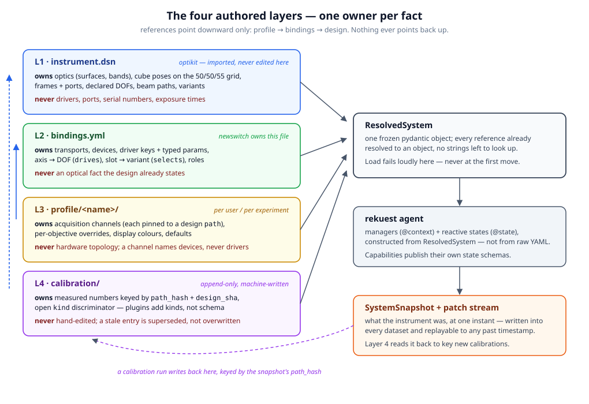
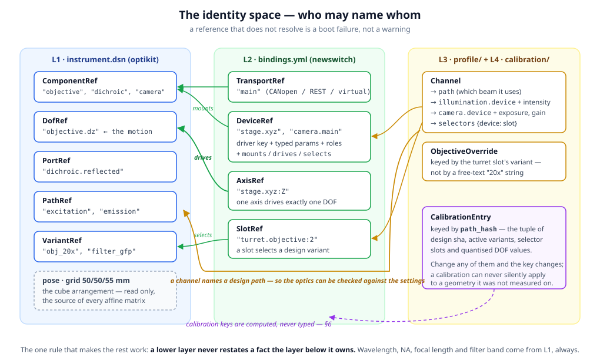
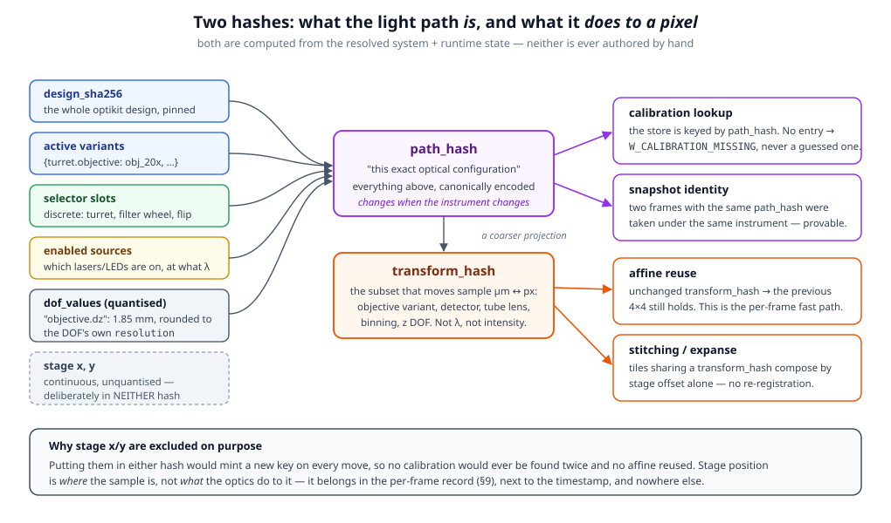
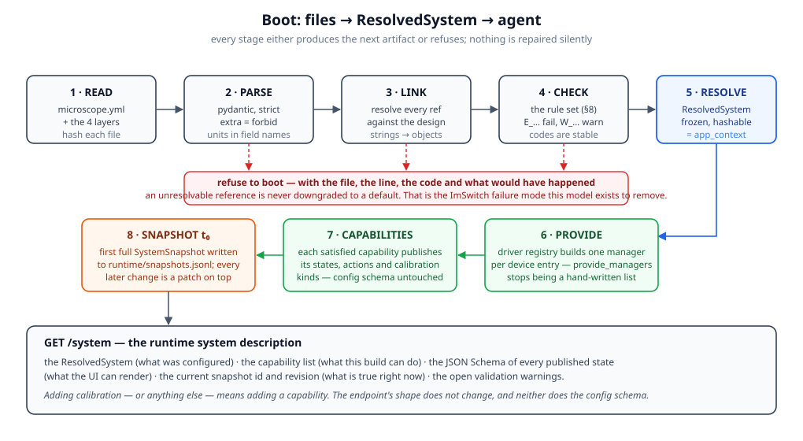
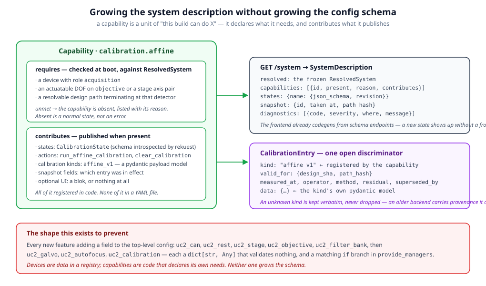
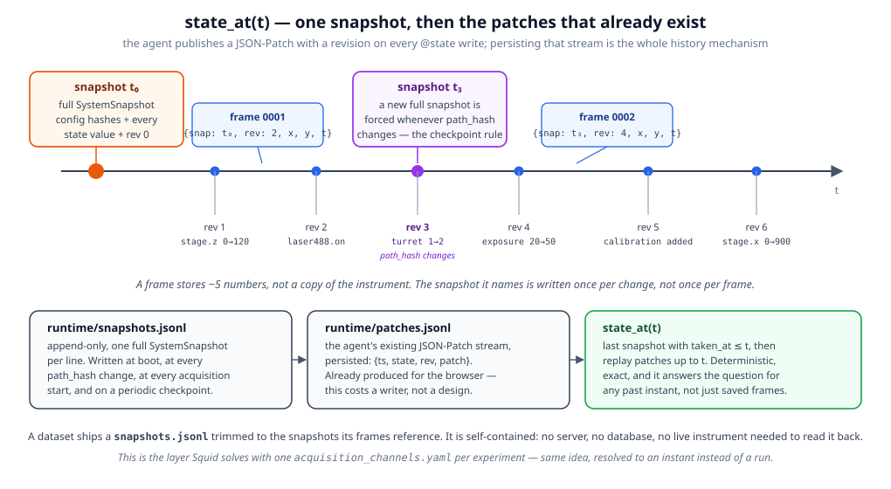
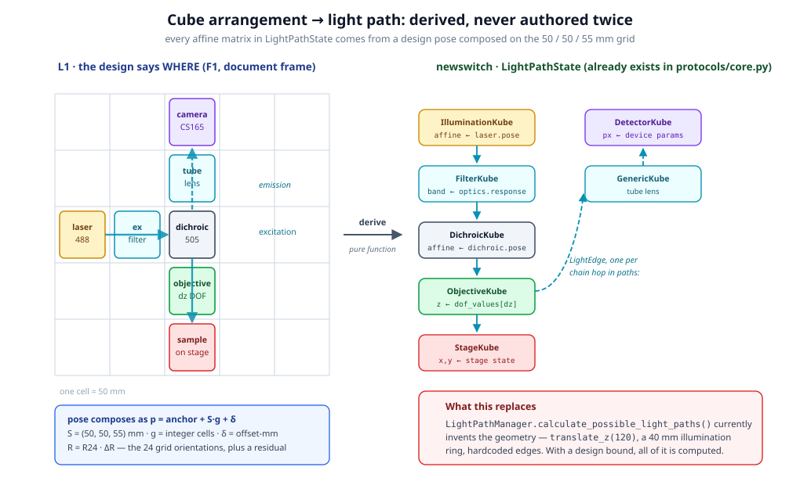

# The newswitch configuration model

*A proposal for how a newswitch deployment describes itself: what the instrument
is, how to actuate it, what to acquire with it, what has been measured about it,
and what state it was in when a given image was taken.*

**Status:** design proposal, nothing implemented. File references are relative to
the repo root and describe the code as of `DEV_BD` (2026-08-22).
**Scope:** the schema and the rules. Implementation, migration tooling and the
frontend surface are named where they are affected but are not specified here.
**Continued by:** [OPTIKIT-INTEGRATION.md](OPTIKIT-INTEGRATION.md) (2026-08-23),
which ratifies §15's open questions and specifies the optikit runtime seam.
Where the two disagree, the newer document wins.

---

## 1 · The problem, stated once

Today a deployment is one flat JSON, parsed by `ImswitchConfig`
([backend/newswitch/app.py:106](../backend/newswitch/app.py#L106)):

```python
uc2_can: dict[str, Any] = {}
uc2_rest: dict[str, Any] = {}
uc2_stage: dict[str, Any] = {}
uc2_illumination: dict[str, Any] = {}
uc2_objective: dict[str, Any] = {}
uc2_filter_bank: dict[str, Any] = {}
```

Six untyped bags, each consumed by a hand-written branch in `provide_managers`,
which returns a 27-element tuple that must be kept in sync with its own return
annotation. It works, and for one bench it is fine. It cannot answer four
questions we now need answered:

1. **What is the light path?** `LightPathManager.calculate_possible_light_paths()`
   ([backend/newswitch/managers/light_path.py](../backend/newswitch/managers/light_path.py))
   invents it — `translate_z(120)` for the dichroic, a 40 mm ring for the
   illumination sources, edges wired by hand. The real answer lives in an
   optikit design and is never consulted.
2. **What was the system doing at 14:32:07?** `CalibratedLightPath` already keys
   on a `light_path_state_hash`
   ([backend/newswitch/protocols/calibration.py](../backend/newswitch/protocols/calibration.py)),
   but nothing computes that hash from anything real, and nothing is written to
   disk.
3. **How do I add a new kind of state?** Today: a new `uc2_*` dict, a new branch,
   a new tuple element, a new return-annotation entry. Four edits in three
   places for every feature.
4. **Is this calibration still valid?** Nothing records what geometry it was
   measured on.

The rest of this document is the smallest model that answers all four, built out
of parts that already work in the three systems we have experience with.

---

## 2 · Prior art — what to take, what to leave

### 2.1 ImSwitch setup JSON

Seen in [backend/tests/fixtures/example_uc2.json](../backend/tests/fixtures/example_uc2.json)
and the per-device fragments optikit ships in `frontend/public/imswitch_configs/`.

```json
"positioners": {
  "ESP32Stage": {
    "managerName": "ESP32StageManager",
    "managerProperties": {"rs232device": "ESP32", "stepsizeX": -0.3125, ...},
    "axes": ["X","Y","Z","A"], "forScanning": true, "forPositioning": true
  }
}
```

| Take | Why |
|---|---|
| **Device = name → driver + params** | The `managerName` indirection is the right shape. A deployment picks a driver; the driver owns its parameters. It is the reason ImSwitch supports hardware nobody anticipated. |
| **Named cross-references** (`rs232device: "ESP32"`) | Devices refer to each other by name, so one transport serves many devices without duplication. |
| **Role flags** (`forAcquisition`, `forScanning`, `forFocusLock`) | "Which camera is *the* camera" is a real question and deserves a first-class answer, not a convention about ordering. |
| **Composable fragments** | optikit assembles a setup from per-device JSON snippets. Config as a set of small mergeable files beats one hand-edited monolith. |

| Leave | Why |
|---|---|
| **`managerProperties` as an untyped bag** | A typo is silently ignored. `stepsizeX` vs `stepSizeX` costs an afternoon. Nothing can list what a driver accepts, so nothing can build a UI for it. |
| **Units in comments, not names** | `stepsizeX: -0.3125` — µm per step, with the sign meaning axis direction. Two facts in one unlabelled float. |
| **No optics whatsoever** | `wavelength: 405` sits in the laser entry and connects to nothing. The file cannot say that this laser reaches that camera through that dichroic. |
| **No version field** | Nothing to migrate against. |

### 2.2 Squid / octopi-research

`software/docs/configuration-system.md`, `software/squid/config.py`,
`software/machine_configs/`.

| Take | Why |
|---|---|
| **Machine config vs. user profile** | "What hardware exists" (rarely changes, owned by whoever built the scope) is a different document from "what settings I use" (changes hourly, owned by the user). Squid splits them and never regrets it. |
| **Per-objective overrides with an explicit merge** | Exposure and intensity genuinely vary by magnification, and the doc states field-by-field which layer wins. |
| **`version: 1.0` on every file** | Cheap, and the only thing that makes migration possible later. |
| **Source-qualified references** — `confocal.1`, `standalone.Emission Wheel` | Two subsystems may both own a filter wheel numbered 1. The reference says which namespace it means. |
| **Implicit binding when unambiguous** | One camera and one wheel → no `hardware_bindings.yaml` needed. Ceremony scales with complexity, not with existence. |
| **The effective config is written into the experiment output** (`acquisition_channels.yaml`) | This is the seed of the whole metadata answer: what was resolved, saved next to the data. |
| **Strict pydantic with units in field names** | `ENCODER_STEP_SIZE`, `MAX_VELOCITY_X_mm`, `SCREW_PITCH` — plus `convert_to_real_units()` on the model itself, so the conversion lives with the numbers it converts. |
| **Calibration in its own per-objective files** with `calibration_timestamp` | Measured data is kept apart from authored data. |

| Leave | Why |
|---|---|
| **The `_def` INI global namespace** | Hundreds of module-level constants behind the typed façade. The pydantic layer is a wrapper over globals, not a replacement for them. |
| **The merge table as prose** | `configuration-system.md` has a beautiful table of which layer owns which field. It is a doc; the code must agree with it by hand. Put the ownership *in the model* and derive both the merge and the table. |
| **CSV side tables** (`objectives.csv`, `sample_formats.csv`) | A third format for no gain. |
| **No optics either** | Same gap as ImSwitch: a filter wheel position is a number, not a passband. |

### 2.3 optikit DSN

`DOCS/DSN-CONTRACT.md`, `src/optikit_core/schema/design.py`,
`golden/fluo-scope.dsn/optikit-design.yml`.

This is the piece that has what the other two lack: it *is* the instrument.

| Take | Why |
|---|---|
| **`components:` keyed by id, with `pose`, `optics`, `dof`** | The cube arrangement, the glass, and the motions, in one document. |
| **`paths:` as a port netlist** — `dichroic.front>reflected` | The beam is data. "Which channel goes through which filter" becomes checkable instead of conventional. |
| **`dof:` with `actuatable: true`** | The DOF's own docstring says it is consumed by "optimization (bounds), CAD (offset), firmware (`actuatable` + axis binding), calibration". The firmware half of that promise is exactly what newswitch owns and does not yet provide. **This is the joint between the two systems.** |
| **`variants:` as component overlays** | A turret with three objectives is three variants. Discrete configuration changes have a name and a schema. |
| **`instantiation.dof_values: {"objective.dz": 1.85}`** | Resolved per-instance values, in a flat keyed map, in exactly the spelling a runtime wants. |
| **Rank-ordered normative sources** (§1 of the contract) | "A disagreement between these is a bug at the lower rank." Ends arguments before they start. |
| **One frame, explicit hops** (§4b, F1–F4) | *No tool converts between two frames implicitly.* Every "the mirror is flipped" bug was two tools silently disagreeing. |
| **Stable, append-only error codes** (`E_FOLD_MESH_MISMATCH`, `W_NO_INSERT_POSE`) | A code is never repurposed or removed once shipped. |
| **`extra="allow"` + a review number until ratified** | Extension by addition, with a paper trail. |
| **Semver ids `<namespace>.<kind>.<name>`** | Library identity that survives forks. |

| Leave / supply | Why |
|---|---|
| **No drivers, transports or runtime** | Correctly out of scope for optikit. newswitch supplies it. |
| **No acquisition channels** | Same. |
| **DOFs declared but unbound** | The missing half. Supplied below as `drives:`. |

### 2.4 The synthesis in one line

> **optikit says what the instrument *is*. ImSwitch's shape says how to *talk* to
> it. Squid's shape says what to *do* with it and what it *was doing*. Take one
> layer from each, give them one identity space, and forbid any layer from
> restating a fact a lower layer owns.**

---

## 3 · Five rules

Everything below follows from these. They are stated first so a disagreement
about a detail can be settled by asking which rule it serves.

**R1 · One owner per fact.** Wavelength, NA, focal length, filter passband, cube
pose and travel range come from the design. Serial ports, node ids, steps per µm
and pixel pitch come from the bindings. Exposure, intensity and channel names
come from the profile. Measured numbers come from the calibration store. A file
that restates a fact another layer owns fails to load — it does not "override".

**R2 · References resolve at load or the process does not start.** A binding
naming a design component that does not exist is a boot failure with a file, a
line and a code. Never a warning, never a default. This is the single most
valuable thing to fix relative to ImSwitch.

**R3 · Derived is never authored.** Affine matrices, light-path graphs, path
hashes, effective per-objective settings, capability lists: all computed. If a
number can be derived from a lower layer, storing it is a bug, because the two
copies will disagree.

**R4 · The schema grows by registration, not by fields.** New hardware = a driver
in a registry. New behaviour = a capability that declares its own requirements
and contributes its own states. Neither adds a field to the config schema.

**R5 · Extend by addition, and keep what you cannot read.** New keys are additive;
codes are append-only; an unrecognised calibration `kind` is carried verbatim
rather than dropped. Discarding provenance you do not understand is how metadata
rots.

---

## 4 · The layers



Four authored layers, one derived object, one runtime stream.

| | Layer | Format | Written by | Changes |
|---|---|---|---|---|
| L1 | `instrument.dsn` | optikit YAML | the optikit editor | when the optics change |
| L2 | `bindings.yml` | YAML | whoever built the scope | when the electronics change |
| L3 | `profile/<name>/` | YAML | the user | per experiment |
| L4 | `calibration/` | YAML, append-only | the machine | per calibration run |
| — | `ResolvedSystem` | in-memory pydantic | the loader | never (frozen) |
| — | `runtime/` | JSONL, append-only | the agent | continuously |

### 4.1 On disk

```
config/
  microscope.yml               # entry point — NEWSWITCH_CONFIG points here
  instrument.dsn/              # the optikit design folder (vendored or a submodule)
    optikit-design.yml
  bindings.yml
  profile/
    default/
      channels.yml
      objectives/
        obj_10x.yml            # keyed by the design VARIANT, not a free-text "10x"
        obj_20x.yml
  calibration/
    <path_hash>/
      affine_v1-2026-08-19T10-31-04Z.yml
      illumination_power_v1-2026-08-02T08-12-55Z.yml
  runtime/
    snapshots.jsonl
    patches.jsonl
```

### 4.2 `microscope.yml` — the entry point

```yaml
newswitch-version: v1

microscope:
  id: uc2.scope.fluo_01           # namespaced, stable for the life of the instrument
  name: "UC2 fluorescence bench 1"
  serial: UC2-2026-014
  site: "Diederich Lab, Jena"

design:
  path: instrument.dsn
  sha256: "4f3a…"                 # pinned; a mismatch is E_DESIGN_DRIFT
  variant: null                   # an optikit design-level variant, if any

bindings: bindings.yml
profile: profile/default
calibration_store: calibration/
runtime_store: runtime/
```

```python
class MicroscopeIdentity(BaseModel):
    model_config = ConfigDict(extra="forbid", frozen=True)

    id: NamespacedId                       # r"^[a-z0-9_]+\.[a-z0-9_]+\.[a-z0-9_]+$"
    name: str
    serial: str | None = None
    site: str | None = None


class DesignBinding(BaseModel):
    model_config = ConfigDict(extra="forbid", frozen=True)

    path: Path | None = None               # None → degraded mode, see §12.4
    sha256: str | None = None              # None → computed and warned (W_DESIGN_UNPINNED)
    variant: str | None = None


class MicroscopeFile(BaseModel):
    model_config = ConfigDict(extra="forbid")

    newswitch_version: Literal["v1"] = Field(alias="newswitch-version")
    microscope: MicroscopeIdentity
    design: DesignBinding = DesignBinding()
    bindings: Path
    profile: Path
    calibration_store: Path = Path("calibration/")
    runtime_store: Path = Path("runtime/")
```

**Why the design is pinned by hash.** Calibration is only meaningful for a
geometry. Optimising a lens spacing in optikit and re-exporting the design must
invalidate every affine calibration measured on the old one — silently. The hash
is what makes that automatic instead of a discipline nobody keeps.

---

## 5 · L2 — `bindings.yml`, the file newswitch owns

This is the new contract. It is the only file that has to be hand-written for a
given build, and it does exactly one job: **bind design ids to drivers.**

```yaml
newswitch-version: v1

transports:
  main:
    driver: uc2.canopen
    params:
      interface: socketcan
      channel: can0
      bitrate: 500000
      sdo_timeout_s: 2.0

devices:

  stage.xyz:
    driver: uc2.stage
    transport: main
    roles: [positioning, scanning]
    axes:
      X:
        node: 11
        sub: 0
        steps_per_um: 3.2
        sign: +1
        min_um: -25000
        max_um:  25000
        home: {enabled: true, direction: -1, speed_steps_per_s: 15000, timeout_s: 20}
      Y: {node: 12, sub: 0, steps_per_um: 3.2, sign: +1, min_um: -25000, max_um: 25000,
          home: {enabled: true, direction: -1, speed_steps_per_s: 15000, timeout_s: 20}}
      Z: {node: 13, sub: 0, steps_per_um: 3.2, sign: +1, min_um:  -7500, max_um:  7500,
          home: {enabled: false}}
    drives:                      # ← the joint with optikit
      X: sample.dx
      Y: sample.dy
      Z: objective.dz

  camera.main:
    driver: uc2.rest.camera
    transport: main
    mounts: camera               # a design component with category: detector
    roles: [acquisition]
    params:
      serial: "CS165MU-4711"
      default_binning: 1
    # NOTE: no pixel_size_um, no sensor dimensions. The design's detector
    # record owns the sensor geometry (R1); the driver reports what the
    # physical camera says and the loader cross-checks the two
    # (E_SENSOR_MISMATCH). See OPTIKIT-INTEGRATION.md §3.

  illumination.ex488:
    driver: uc2.laser
    transport: main
    mounts: laser                # design component, category: source
    roles: [epi]
    params: {node: 21, channel: 0, pwm_max: 1023}
    # NOTE: no wavelength here. The design's source.wavelengths_um owns it (R1).

  turret.objective:
    driver: uc2.turret
    transport: main
    selects: objective           # the design component this turret swaps
    params: {node: 14, axis: A, steps_per_deg: 1.0, home_on_start: true}
    slots:
      1: {variant: obj_10x, position_deg:   0.0}
      2: {variant: obj_20x, position_deg: 120.0}
      3: {variant: obj_40x, position_deg: 240.0}

  wheel.emission:
    driver: uc2.filter_wheel
    transport: main
    selects: emission-filter
    params: {node: 15, axis: A, steps_per_deg: 1.0}
    slots:
      1: {variant: empty,     position_deg:  0.0}
      2: {variant: bp525_50,  position_deg: 90.0}
      3: {variant: bp600_50,  position_deg: 180.0}
```

### 5.1 The three binding verbs

Every device relates to the design through at most one of these. They are the
whole vocabulary.

| verb | means | target | example |
|---|---|---|---|
| `mounts` | "this device *is* that design component" | a `ComponentRef` | a camera is the `camera` component |
| `drives` | "this axis *moves* that declared DOF" | `AxisName → DofRef` | `Z: objective.dz` |
| `selects` | "this device *swaps* that component between variants" | a `ComponentRef` + slots | a turret picks `obj_20x` |

`drives` is the load-bearing one. `DofSpec` in optikit already carries `range`,
`resolution`, `unit`, `axis` and `actuatable`; `bindings.yml` supplies the axis
that actuates it. Consequences fall out immediately:

- **Travel limits are checked, not duplicated.** The design says
  `range: [-7.5, 7.5]` mm; the axis says `min_um: -7500, max_um: 7500`. They must
  agree, and a mismatch is `E_RANGE_MISMATCH` at boot — not a crash into a
  hard stop at 03:00.
- **Step resolution is checked.** `steps_per_um: 3.2` against
  `resolution: 0.05 mm` tells you whether the mechanics can even reach the
  positions the optimiser proposes.
- **A move updates the optics.** Moving Z writes `dof_values["objective.dz"]`;
  the light path recomputes; the affine changes; the metadata is right. That
  closes the loop from motor to metadata, which is the entire point of binding
  the two systems together.
- **Motors stay in the design's BOM.** An optikit `category: electronics`
  component carries the motor's part identity and no optics. newswitch never
  restates which motor it is — only which axis drives which motion.

### 5.2 The model

```python
DriverKey = Annotated[str, StringConstraints(pattern=r"^[a-z0-9_]+(\.[a-z0-9_]+)+$")]


class DeviceRole(StrEnum):
    ACQUISITION = "acquisition"      # ImSwitch forAcquisition / Squid camera id
    FOCUS_LOCK  = "focus_lock"       # ImSwitch forFocusLock
    POSITIONING = "positioning"
    SCANNING    = "scanning"
    EPI         = "epi"              # Squid epi_illumination
    TRANS       = "trans"            # Squid transillumination


class HomingSpec(BaseModel):
    model_config = ConfigDict(extra="forbid", frozen=True)
    enabled: bool = False
    direction: Literal[-1, 1] = -1
    speed_steps_per_s: int = 15000
    timeout_s: float = 20.0


class AxisBinding(BaseModel):
    """One motor axis. Every field carries its unit in its name (Squid's rule)."""
    model_config = ConfigDict(extra="forbid", frozen=True)

    node: int | None = None
    sub: int = 0
    steps_per_um: float | None = None     # linear axes
    steps_per_deg: float | None = None    # rotary axes — exactly one of the two
    sign: Literal[-1, 1] = 1
    min_um: float | None = None
    max_um: float | None = None
    max_speed_um_per_s: float | None = None
    backlash_um: float = 0.0
    home: HomingSpec = HomingSpec()

    @model_validator(mode="after")
    def _one_scale(self) -> "AxisBinding":
        if (self.steps_per_um is None) == (self.steps_per_deg is None):
            raise ValueError("give exactly one of steps_per_um / steps_per_deg")
        return self


class SlotBinding(BaseModel):
    model_config = ConfigDict(extra="forbid", frozen=True)
    variant: VariantRef                   # resolved against design.variants
    position_deg: float | None = None
    position_um: float | None = None
    label: str | None = None              # UI only; never a reference target


class DeviceBinding(BaseModel):
    model_config = ConfigDict(extra="forbid", frozen=True)

    driver: DriverKey
    transport: TransportRef | None = None
    roles: frozenset[DeviceRole] = frozenset()

    mounts:  ComponentRef | None = None
    drives:  dict[str, DofRef] = {}
    selects: ComponentRef | None = None

    axes:  dict[str, AxisBinding] = {}
    slots: dict[int, SlotBinding] = {}

    #: Driver-specific parameters. Typed at LINK time by looking the model up in
    #: the driver registry — never `dict[str, Any]` at the point of use.
    params: dict[str, JsonValue] = {}


class BindingsFile(BaseModel):
    model_config = ConfigDict(extra="forbid")
    newswitch_version: Literal["v1"] = Field(alias="newswitch-version")
    transports: dict[str, TransportBinding] = {}
    devices: dict[DeviceRef, DeviceBinding] = {}
```

### 5.3 How `params` stays typed

`params` is a `dict` in the *file* model and never a `dict` in the *resolved*
model. Each driver registers a pydantic params model:

```python
@driver("uc2.stage", params=UC2StageParams, manager=UC2StageManager)
class UC2StageDriver: ...
```

At LINK time (§7 step 3) the loader looks up the driver, validates `params`
against its model with `extra="forbid"`, and stores the **typed instance** on
`ResolvedDevice.params`. Three things follow:

- a typo is `E_DRIVER_PARAM` with the offending key and the accepted keys;
- `GET /system` can serve the JSON Schema of every driver, so a setup UI can be
  generated rather than written;
- a driver in a plugin package works exactly like a built-in one (R4).

This is ImSwitch's `managerName`/`managerProperties` shape with the validation
put back in — the one change that would have prevented most of the configuration
bugs any of us have debugged.

---

## 6 · L3 — the profile

Squid's layer, with two changes: a channel names a **design path**, and the
merge is declared in the model instead of in a doc table.

```yaml
# profile/default/channels.yml
newswitch-version: v1

channels:
  - name: "GFP"
    enabled: true
    display_color: "#1FFF00"
    path: excitation                  # ← a design path id. Checkable.
    illumination:
      device: illumination.ex488
      intensity_pct: 20.0
    selectors:
      wheel.emission: 2               # slot, not a filter name
    camera:
      device: camera.main
      exposure_ms: 20.0
      gain: 10.0
      binning: 1
    z_offset_um: 0.0

  - name: "Brightfield"
    enabled: true
    display_color: "#FFFFFF"
    path: transmission
    illumination: {device: illumination.led_white, intensity_pct: 5.0}
    selectors: {wheel.emission: 1}
    camera: {device: camera.main, exposure_ms: 8.0, gain: 2.0}
    z_offset_um: -1.2
```

```yaml
# profile/default/objectives/obj_20x.yml — keyed by the DESIGN VARIANT
newswitch-version: v1
channels:
  GFP:
    illumination: {intensity_pct: 35.0}
    camera: {exposure_ms: 50.0, gain: 5.0}
```

### 6.1 The merge, declared

Squid's `configuration-system.md` has an excellent table of which layer owns
which field, maintained by hand alongside the code. Put the ownership in the
field:

```python
def general(**kw):    return Field(json_schema_extra={"owner": "general"}, **kw)
def objective(**kw):  return Field(json_schema_extra={"owner": "objective"}, **kw)


class CameraSettings(BaseModel):
    model_config = ConfigDict(extra="forbid", frozen=True)
    device: DeviceRef = general()
    exposure_ms: float = objective(gt=0)
    gain: float = objective(ge=0)
    binning: int = objective(default=1, ge=1)


class Channel(BaseModel):
    model_config = ConfigDict(extra="forbid", frozen=True)

    name: str = general()
    enabled: bool = general(default=True)
    display_color: HexColor = general(default="#FFFFFF")

    path: PathRef = general()                       # identity: never overridable
    illumination: IlluminationSettings
    selectors: dict[DeviceRef, int] = general(default_factory=dict)
    camera: CameraSettings
    z_offset_um: float = general(default=0.0)
```

One generic `merge(general, override)` walks the models and applies exactly the
`owner == "objective"` fields. The doc table is then *generated* from the schema,
so it cannot drift. An override touching a `general`-owned field is
`E_OVERRIDE_FORBIDDEN`, naming the field and its owner.

### 6.2 What `path:` buys

Because a channel names a design path, and the design carries spectral responses
(optikit's `response: {kind: dichroic, reflect-bands-um: …}`), the loader can
trace the channel:

- source at 488 nm → excitation filter BP470-490 → dichroic reflects below
  505 → objective → sample: **passes**;
- the same channel with `wheel.emission: 3` (BP600/50) in the emission arm:
  nothing from a 520 nm emitter reaches the detector — `W_CHANNEL_DEAD`, at
  config load, with the blocking element named.

Neither ImSwitch nor Squid can express this, because neither knows the optics.
optikit knows the optics and has no channels. This check is the concrete payoff
for joining them, and it catches the single most common bench mistake.

---

## 7 · Identity and references



All references are strings in files and typed objects after LINK.

| Type | Spelling | Resolves against | Borrowed from |
|---|---|---|---|
| `ComponentRef` | `objective` | `design.components` | optikit |
| `DofRef` | `objective.dz` | `design.components[c].dof[n]` | optikit `dof_values` keys, verbatim |
| `PortRef` | `dichroic.reflected` | `design` ports | optikit chain entries, verbatim |
| `PathRef` | `excitation` | `design.paths` | optikit |
| `VariantRef` | `obj_20x` | `design.variants` | optikit |
| `TransportRef` | `main` | `bindings.transports` | ImSwitch `rs232device` |
| `DeviceRef` | `stage.xyz` | `bindings.devices` | ImSwitch device names, namespaced |
| `AxisRef` | `stage.xyz:Z` | a device's `axes` | new |
| `SlotRef` | `turret.objective:2` | a device's `slots` | Squid's source-qualified refs |
| `ChannelRef` | `GFP` | `profile.channels` | Squid |

Two rules govern the graph:

- **Direction.** L3 → L2 → L1. Never upward, never sideways within a layer
  except device → transport. A cycle is `E_REF_CYCLE`.
- **Reuse the neighbour's spelling.** `DofRef` and `PortRef` are optikit's
  formats character-for-character, so `parse_dof_key` and `parse_chain_entry`
  (`src/optikit_core/schema/design.py`) work unchanged and there is no
  translation layer to get wrong.

---

## 8 · The two hashes



`LightPathState.hash` and `LightPathState.transformation_hash` already exist in
[backend/newswitch/protocols/core.py](../backend/newswitch/protocols/core.py) with
placeholder implementations (`f"hash_{objective.slot}_{detector.slot}_…"`). Here
is what they should be.

### 8.1 `path_hash` — "this exact optical configuration"

A canonical encoding of:

| input | from |
|---|---|
| `design_sha256` | `microscope.yml` |
| active variants, sorted | selector device states → `slots[n].variant` |
| selector slots, sorted | runtime state |
| enabled sources + active wavelength | runtime state + design `source` |
| `dof_values`, **quantised to each DOF's own `resolution`** | runtime state |

```python
def path_hash(sys: ResolvedSystem, rt: RuntimeState) -> str:
    payload = {
        "design": sys.design_sha256,
        "variants": sorted(rt.active_variants),
        "slots": {d: s for d, s in sorted(rt.selector_slots.items())},
        "sources": sorted((s, rt.wavelength_um[s]) for s in rt.enabled_sources),
        "dof": {k: quantise(v, sys.dof[k].resolution)
                for k, v in sorted(rt.dof_values.items())},
    }
    return blake2b(canonical_json(payload), digest_size=16).hexdigest()
```

Quantisation matters: without it a 5 nm dither on a piezo mints a new hash on
every read, and no calibration is ever found twice.

### 8.2 `transform_hash` — "what the optics do to a pixel"

A coarser projection over only what affects sample-µm ↔ pixel: the objective
variant, the detector and its binning, the tube lens, and z-affecting DOFs. Not
wavelength, not intensity, not the emission filter.

Two consumers, both hot paths:

- **Affine reuse.** Unchanged `transform_hash` → the previous 4×4 still holds.
  This is what `LightPath.transformation_hash()` is reaching for today.
- **Stitching.** Tiles sharing a `transform_hash` compose by stage offset alone.

### 8.3 Stage x/y are deliberately in neither

Including them would mint a new key on every move — no calibration found twice,
no affine ever reused. Stage position is *where the sample is*, not *what the
optics do to it*. It belongs in the per-frame record (§10), next to the
timestamp, and nowhere else.

---

## 9 · Boot: the resolve pipeline



| # | Stage | Produces | Fails with |
|---|---|---|---|
| 1 | READ | file bytes + sha256 per file | `E_FILE_MISSING`, `E_DESIGN_DRIFT` |
| 2 | PARSE | `MicroscopeFile`, `BindingsFile`, `ProfileFile`, `DesignDecl` | pydantic errors, path-annotated |
| 3 | LINK | every ref → object; every `params` → typed model | `E_UNRESOLVED_REF`, `E_UNKNOWN_DRIVER`, `E_DRIVER_PARAM` |
| 4 | CHECK | diagnostics list | `E_*` refuse; `W_*` recorded and served |
| 5 | RESOLVE | `ResolvedSystem` — frozen, hashable | — |
| 6 | PROVIDE | one manager per device, from the registry | `E_DRIVER_INIT` |
| 7 | CAPABILITIES | published states, actions, calibration kinds | — |
| 8 | SNAPSHOT | first `SystemSnapshot` at revision 0 | — |

`ResolvedSystem` replaces `ImswitchConfig` as the `@app_context` object. Because
it is frozen and fully linked, `provide_managers` stops being a hand-maintained
27-element tuple and becomes a loop over `resolved.devices`, with the registry
supplying both the manager and its published state type.

### 9.1 The rule set

Codes are **stable and append-only** — never repurposed, never removed
(optikit's discipline, and the reason its error messages are worth reading).

| Code | Severity | Meaning |
|---|---|---|
| `E_DESIGN_DRIFT` | error | design sha256 ≠ the pin in `microscope.yml` |
| `E_UNRESOLVED_REF` | error | a ref names something that does not exist |
| `E_REF_CYCLE` | error | reference cycle |
| `E_UNKNOWN_DRIVER` | error | driver key not in the registry |
| `E_DRIVER_PARAM` | error | unknown or invalid driver parameter |
| `E_DOF_NOT_ACTUATABLE` | error | an axis drives a DOF with `actuatable: false` |
| `E_DOF_DOUBLE_DRIVEN` | error | two axes drive one DOF |
| `E_RANGE_MISMATCH` | error | axis limits exceed the DOF's declared `range` |
| `E_SENSOR_MISMATCH` | error | driver-reported sensor geometry disagrees with the design's detector record |
| `E_SLOT_VARIANT_UNKNOWN` | error | a slot names a variant the design does not define |
| `E_OVERRIDE_FORBIDDEN` | error | an objective file overrides a `general`-owned field |
| `E_RESTATED_FACT` | error | bindings/profile restate a fact the design owns (R1) |
| `E_ROLE_AMBIGUOUS` | error | two devices claim `acquisition` and no channel disambiguates |
| `W_DESIGN_UNPINNED` | warn | no `sha256` given; computed and recorded |
| `W_NO_DESIGN` | warn | running in degraded mode (§12.4) |
| `W_CHANNEL_DEAD` | warn | a channel's own selectors block its own light |
| `W_CALIBRATION_MISSING` | warn | no calibration entry for the current `path_hash` |
| `W_CALIBRATION_STALE` | warn | entry exists but was measured on a superseded design |
| `W_DOF_UNDRIVEN` | warn | design declares an actuatable DOF nothing drives |
| `W_RESOLUTION_COARSE` | warn | `steps_per_um` cannot reach the DOF's `resolution` |

Every diagnostic carries `{code, severity, where: "<file>:<jsonpath>", message,
hint}` and every one of them is served on `GET /system` — the UI can show the
open warnings for a bench without anyone reading a log.

---

## 10 · The runtime system description



The ask was a description *at runtime* that can grow — "new state additions like
calibration". The answer is a **capability**: a unit of "this build can do X",
which declares what it needs and contributes what it publishes.

```python
class Capability(Protocol):
    id: str                                   # "calibration.affine", "autofocus.software"

    def requirements(self) -> list[Requirement]: ...
    def contributes(self) -> Contribution: ...


class Contribution(BaseModel):
    states: list[type]                        # @state classes → schema published
    actions: list[Callable]                   # @register functions
    calibration_kinds: list[type[CalibrationPayload]]
    snapshot_fields: dict[str, type]
    bloks: list[Blok] = []
```

A capability is **present** iff its requirements resolve against
`ResolvedSystem`. `calibration.affine` needs a device with role `acquisition`, an
actuatable stage pair, and a design `path` terminating at that detector. Absent
is a normal state, reported with its reason — not an error, not a crash at first
use.

```
GET /system → SystemDescription
  resolved:     the frozen ResolvedSystem
  capabilities: [{id, present, reason, contributes: {states, actions, kinds}}]
  states:       {name: {json_schema, revision}}
  snapshot:     {id, taken_at, path_hash, transform_hash}
  diagnostics:  [{code, severity, where, message, hint}]
```

The frontend already generates typed hooks from the running backend's schema
endpoints (`docs/ARCHITECTURE.md` §2), so a capability that ships a new `@state`
appears in the API surface without a frontend release. **Adding calibration adds
no field to any config file.** That is R4, and it is the whole answer to
"describes e.g. new state additions".

### 10.1 Calibration entries — one open discriminator

```python
class CalibrationEntry(BaseModel):
    model_config = ConfigDict(extra="allow")     # R5: keep what you cannot read

    kind: str                                    # registered by a capability
    schema_version: int = 1

    valid_for: PathIdentity                      # {design_sha256, path_hash}
    measured_at: AwareDatetime
    measured_by: str | None = None               # operator or routine id
    method: str                                  # "grid_cross_correlation", …
    inputs: dict[str, JsonValue] = {}            # what the run was given
    residual: float | None = None                # goodness, in the kind's units
    superseded_by: str | None = None             # entry id — never delete, supersede

    data: JsonValue                              # validated against the kind's model
```

Two properties worth naming:

- **Keyed by `path_hash`, so it cannot be misapplied.** Change the objective and
  the key changes; the affine measured at 20× can never silently apply at 10×.
  This is what today's `CalibratedLightPath.light_path_state_hash` intends.
- **Append-only, superseded not overwritten.** A recalibration writes a new file
  and points the old one's `superseded_by` at it. The history of what the
  instrument believed about itself is part of the data.

Registered kinds to start: `affine_v1` (sample µm ↔ pixel), `illumination_power_v1`
(intensity % → mW, Squid's `intensity_calibrations/*.csv` typed), `focus_map_v1`
(sample tilt), `laser_af_v1` (Squid's `laser_af_configs/{objective}.yaml`),
`flatfield_v1`. Adding a sixth is a capability, not a schema change.

---

## 11 · Metadata: what state the system was in at time *t*



Squid solves this with one `acquisition_channels.yaml` per experiment — the
effective config, saved next to the data. Take that idea and resolve it to an
*instant* rather than a run, using a mechanism the agent already has.

### 11.1 The snapshot

```python
class SystemSnapshot(BaseModel):
    model_config = ConfigDict(extra="allow", frozen=True)

    snapshot_id: str                       # content hash — identical states dedupe
    taken_at: AwareDatetime
    reason: SnapshotReason                 # boot | path_change | acquisition_start | checkpoint

    config: ConfigIdentity                 # sha256 of design, bindings, profile + versions
    software: SoftwareIdentity             # newswitch version, plugin versions, optikit version

    path_hash: str
    transform_hash: str
    light_path: LightPathState             # the existing model — kubes + edges + affines

    active_variants: dict[DeviceRef, VariantRef]
    selector_slots: dict[DeviceRef, int]
    dof_values: dict[DofRef, float]        # optikit spelling: {"objective.dz": 1.85}

    states: dict[str, StateSnapshot]       # every published @state: {revision, schema_sha, value}
    calibrations: list[CalibrationRef]     # which entries were in effect
    diagnostics: list[Diagnostic]          # warnings open at this instant
```

### 11.2 Snapshot + patches = `state_at(t)`

The agent already publishes a JSON-Patch with a monotonic revision on every
`@state` write — that is how the browser stays in sync (`docs/ARCHITECTURE.md`
§2.6). **Persist that same stream** and the history mechanism is finished:

```
runtime/snapshots.jsonl   one full SystemSnapshot per line
runtime/patches.jsonl     {ts, state, revision, patch} per line
```

`state_at(t)` = the last snapshot with `taken_at ≤ t`, then replay patches up to
`t`. Exact, deterministic, and it answers the question for **any** past instant,
not only for instants where a frame happened to be saved.

Full snapshots are written at boot, at every `path_hash` change, at every
acquisition start, and on a periodic checkpoint — so a replay never has to walk
more than a bounded number of patches.

### 11.3 Per-frame records stay small

```python
class FrameRecord(BaseModel):
    frame_id: str
    snapshot_id: str        # → the full instrument state
    revision: int           # → the exact point in the patch stream
    t: AwareDatetime
    stage_um: tuple[float, float, float]
    channel: ChannelRef
```

Six fields, not a copy of the instrument. At 100 fps a full snapshot per frame is
gigabytes of duplicated YAML; this is a few hundred bytes with strictly more
information, because the revision pins the exact instant rather than the nearest
save.

A dataset ships a `snapshots.jsonl` trimmed to the snapshots its frames
reference, so it is self-contained: no server, no database, no live instrument
needed to read it back years later.

### 11.4 Relation to `Metadata` today

The existing `Metadata` model (`protocols/core.py`) carries `affine_matrix`,
`fov_width/height`, `light_state` and `acquisition_time` on **every image**. It
becomes a **view**, computed on export from `(snapshot_id, revision)` — so
OME-TIFF / OME-Zarr writers get exactly what they need without the runtime paying
to serialize a light path per frame.

---

## 12 · Cube arrangement → light path



> **Ratified 2026-08-23:** the "derive" arrow below is implemented by the
> **optikit service**, not reimplemented in newswitch. newswitch sends the
> design + current `dof_values`/variants and receives the traced path; the
> kube/edge mapping in §12.2 is the projection of that response. Caching is
> keyed by `path_hash`. See [OPTIKIT-INTEGRATION.md](OPTIKIT-INTEGRATION.md) §2.

### 12.1 What is derived

`LightPathManager.calculate_possible_light_paths()` currently invents the
geometry: `Affine.new().translate_z(120)` for the dichroic, a 40 mm radial ring
for illumination sources, hand-wired edges. With a design bound, all of it is
computed:

- **`Kube.affine_matrix`** ← the component's F1 pose, composed as optikit
  defines it (DSN-CONTRACT §3): `p = anchor + S·g + δ` with `S = (50, 50, 55)` mm,
  and `R = R24 · ΔR`. The cube arrangement *is* the light path geometry.
- **`LightEdge`** ← one per hop in the design's `paths[*].chain`. The netlist is
  authored in optikit; newswitch reads it.
- **Which paths exist** ← `design.paths`, filtered to those whose sources are
  enabled and whose selectors are in a passing state.

### 12.2 Category → kube type

| optikit `category` | newswitch kube | notes |
|---|---|---|
| `source` | `IlluminationKube` | λ from `source.wavelengths_um`; intensity from runtime |
| `dichroic` | `DichroicKube` | bands from `optics.fragment.surfaces[*].response` |
| `filter` | `FilterKube` | ditto |
| `lens` (selected by a turret) | `ObjectiveKube` + `ObjectiveTurretKube` | turret = the `selects` device |
| `detector` | `DetectorKube` | sensor geometry from the design record; driver + serial from the binding |
| `sample` | `StageKube` | the thing the stage moves |
| `slm`, `display` | `GenericKube` | `state_accessor` points at the driving state |
| `electronics`, `mechanics` | *not in the light path* | BOM identity only |
| anything else | `GenericKube` | |

`newswitch.protocols.core` needs no new kube types for this. What changes is
where the numbers come from.

### 12.3 Which frame the affine speaks

optikit's four-frame discipline (DSN-CONTRACT §4b) is worth adopting verbatim,
because it is the part of that contract earned through the most pain:

> F1 document (z up, the grid) · F2 record (+z = optical axis) · F3 cube/mesh
> (z = pin axis) · F4 viewer (never persisted).

newswitch stores **F1 only**. `Kube.affine_matrix` is the F2→F1 hop already
composed; the F2→F3 `insert-pose` is optikit's business and never crosses into
newswitch. And the frame newswitch adds — sample µm ↔ **pixel** — is not a fifth
coordinate frame in the design: it is the *calibration*, measured, keyed by
`transform_hash`, living in L4. Keeping that boundary sharp is what stops the
"flipped again" class of bug from reappearing on this side.

### 12.4 Running without a design

newswitch must boot on a bench with no optikit design. Then:

- `design.path: null` → `W_NO_DESIGN`;
- a **synthetic design** is generated from the bindings alone: one `source` per
  illumination device, one `sample`, one `detector` per acquisition camera, and a
  straight path between them, with poses on the grid derived from device order;
- `mounts` targets resolve against the synthetic design, so `bindings.yml` does
  not change shape;
- `path_hash` still works (it hashes the synthetic design's sha);
- affines fall back to identity until a calibration exists.

Degraded, explicitly, with one warning — rather than a second code path.

---

## 13 · Clean slate — no migration

*Ratified 2026-08-23: the current config system was a scaffold to have
something running; it is removed outright. No converter, no v0 shim, no
compatibility window.*

- `ImswitchConfig`, the flat `uc2_*` dict fields, and the per-transport
  branches in `provide_managers` are **deleted**, not wrapped.
- [backend/scripts/convert_imswitch_setup.py](../backend/scripts/convert_imswitch_setup.py)
  and the old flat configs (`backend/configs/uc2_canopen.json`,
  `backend/configs/uc2_serial.json`) go with them. Their contents are
  re-authored once as a `bindings.yml` — worked examples, not migration
  targets.
- `NEWSWITCH_CONFIG` points at a `microscope.yml` and accepts nothing else;
  any other input is `E_FILE_MISSING`/a parse error, never a fallback.
- `provide_managers` is rewritten as the registry loop (§9 step 6) in the
  same change — the 27-element return tuple goes away with the config it
  parsed.

The one thing preserved from the old system is knowledge, not code: the
driver params models for `uc2.canopen` / `uc2.rest` / `uc2.stage` / … are
transcriptions of today's `UC2CanBusConfig`, `UC2RestBusConfig`,
`UC2StageConfig` dataclasses into registry-owned pydantic models.

---

## 14 · Rank order

Borrowed from DSN-CONTRACT §1 — a disagreement between these is a bug at the
lower rank.

| Rank | Source | Defines |
|---|---|---|
| 1 | optikit `optikit-design.yml` + `src/optikit_core/schema/` | optics, geometry, cube poses, DOFs, paths, variants |
| 2 | `backend/newswitch/config/*.py` (pydantic) | bindings, profile, calibration, snapshot, capabilities |
| 3 | JSON Schema export (`newswitch schema`) | the machine-readable form of rank 2 |
| 4 | frontend generated TS types | the UI's view |

And one addition specific to this seam: **the design outranks the bindings.**
Where a binding restates an optical fact, load fails (`E_RESTATED_FACT`) rather
than one of the two silently winning.

---

## 15 · Decisions (ratified 2026-08-23; details in OPTIKIT-INTEGRATION.md)

Formerly the open questions. Each was answered in Bene's review; the ones
that grew into designs are specified in
[OPTIKIT-INTEGRATION.md](OPTIKIT-INTEGRATION.md).

1. **Where does the design live?** → In a **versioned optikit-core service**
   running next to newswitch (one compose file). `microscope.yml` keeps the
   hash pin; the service holds the design and serves the light path on
   demand. §12's derivation is a *service call*, not a newswitch
   reimplementation. Details: OPTIKIT-INTEGRATION §2.
2. **Multi-detector paths.** → **One light path per acquisition device.**
   `LightPathState` becomes `paths: dict[DeviceRef, LightPath]`; `path_hash`
   is per-device (its inputs already include the detector). OPTIKIT-INTEGRATION §10.
3. **Sample formats.** → **The sample becomes an optikit primitive**
   long-term (a carrier record: well geometry, A1 offset). Until that
   primitive exists, well-plate definitions sit in the profile as an interim
   home, marked as such.
4. **Fibers.** → **A fiber is a teleport.** The kube graph re-anchors the
   source (or point detector) at the far port; the fiber contributes optical
   path length but no geometric edge. `LightEdge` gains `kind: fiber`.
   OPTIKIT-INTEGRATION §10.
5. **Who may write L3?** → **Profile edits live in reactive state and are
   exported to YAML on explicit save.** The file on disk stays the authored
   truth at boot; the running system never writes it behind the user's back.
6. **`path_hash` stability across renames.** → **Recalibration is the honest
   answer.** A rename is a design change like any other: it re-hashes, old
   entries become `W_CALIBRATION_STALE`, and nothing migrates keys — per the
   persistence rule (OPTIKIT-INTEGRATION §8).
```
