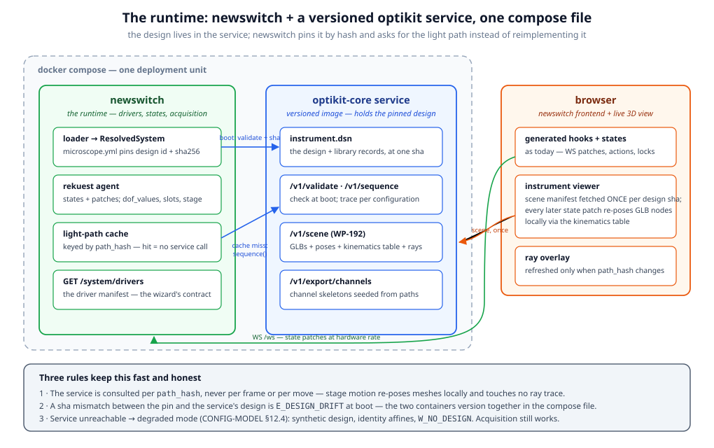
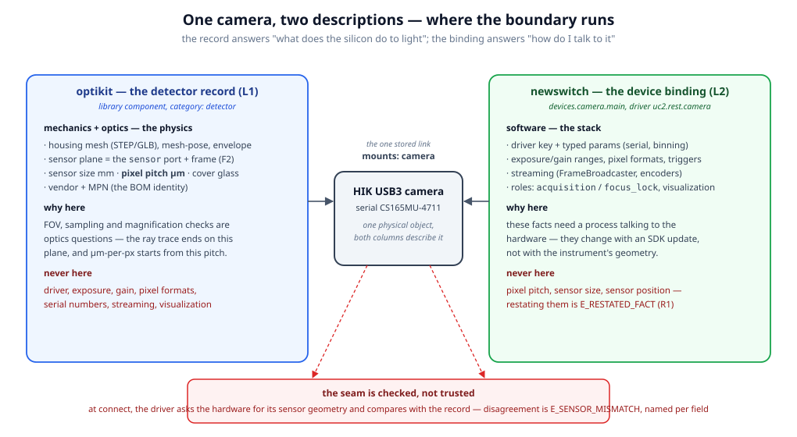
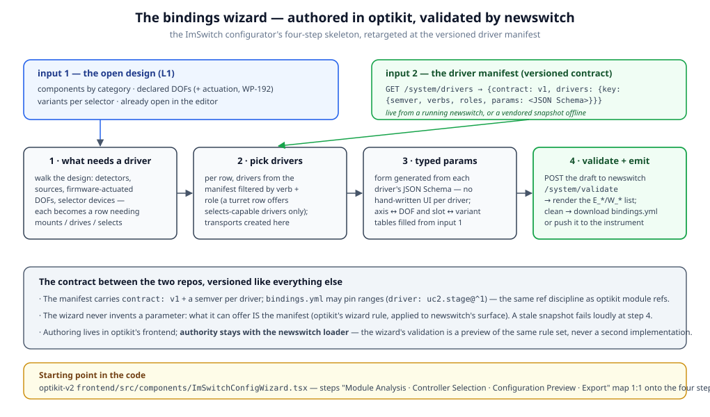
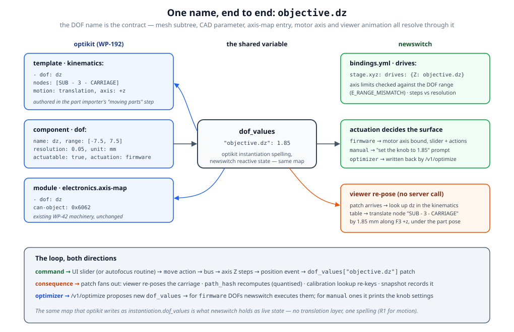
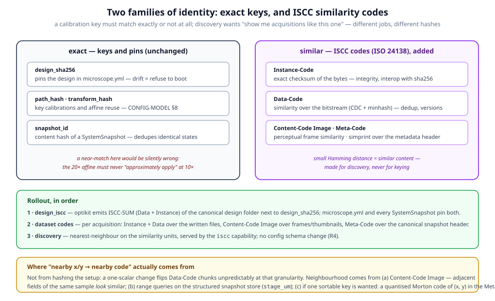

# newswitch × optikit — the runtime integration

*Builds on [CONFIG-MODEL.md](CONFIG-MODEL.md): that document defines the four
layers, the reference rules and the hashes; this one specifies the seam with
optikit at runtime — the service, the detector boundary, the wiring UI, the
kinematics chain, the viewer, and content identity. It ratifies CONFIG-MODEL
§15's open questions (2026-08-23 review). Where the two disagree, this one wins.*

**Companion on the optikit side:** **WP-192** in optikit-v2's working backlog
(`frontend/DOCS/kicad-for-optics-part2s.md`, §5c "The newswitch bridge") —
the kinematics + actuation schema extension this document consumes.

---

## 1 · The decisions, in one table

| Question (CONFIG-MODEL §15 + review) | Decision | Where |
|---|---|---|
| Where does the design live? | a versioned optikit-core **service container** next to newswitch | §2 |
| Old config system compatibility? | **none — clean slate**, old code deleted, no converter | CONFIG-MODEL §13 |
| How precisely does optikit describe a detector? | mechanics + sensor geometry in the record; driver stack in newswitch; seam cross-checked | §3 |
| Where is the optikit↔newswitch link made, and how does the UI look? | the **bindings wizard** in optikit's frontend, against newswitch's versioned **driver manifest** | §4 |
| How do movable parts (imported STP subgroups) become drivable variables? | **WP-192**: template `kinematics:` + DOF `actuation:` enum; newswitch `drives:` binds the motor | §5 |
| How is the ray path visualized inside newswitch? | a viewer consuming the **scene manifest** once + state patches locally; rays per `path_hash` only | §6 |
| Do `channels.yml` / objective overrides stem from optikit? | **seeded** from the design (identity), **owned** by the profile (tunables) | §7 |
| Calibration vs. built facts — who persists where? | rule **R6**: built / measured / chosen spaces, with an invalidation matrix | §8 |
| ISCC hashing of data + setup? | exact keys stay; ISCC codes **added** for identity + discovery, `design_iscc` first | §9 |
| Light path per detector? Fibers? Sample formats? | one path **per acquisition device**; fibers **teleport**; sample becomes an optikit **primitive** | §10 |
| Who writes L3? `path_hash` across renames? | profile edits in state, exported on save; renames → **recalibrate** | CONFIG-MODEL §15 |

---

## 2 · The optikit service is part of the runtime



The design does not live in newswitch's config folder. It lives in a
**versioned optikit-core container** deployed next to newswitch in one compose
file, and newswitch treats it the way it treats any bus: a peer with a
contract.

```yaml
# compose.yaml (sketch)
services:
  newswitch:
    image: openuc2/newswitch:1.x
    environment: {NEWSWITCH_CONFIG: /config/microscope.yml, OPTIKIT_URL: "http://optikit:8000"}
    volumes: ["./config:/config", "./runtime:/runtime", "./calibration:/calibration"]
  optikit:
    image: openuc2/optikit-core:0.y        # versioned — the pair upgrades together
    volumes: ["./config/instrument.dsn:/designs/instrument.dsn:ro"]
```

### 2.1 What newswitch asks it, and when

| Call | When | Cached by |
|---|---|---|
| `POST /v1/validate` + design sha check | boot (LINK stage) | — |
| `POST /v1/sequence` (per path, with current `dof_values`, variants, slots) | on `path_hash` change | `path_hash` |
| `POST /v1/compile` (affine chain / folded optic) | on `transform_hash` change | `transform_hash` |
| `GET /v1/scene` (GLBs + poses + kinematics table) — WP-192 | once per design sha | design sha |
| `POST /v1/export/channels` (seeds, §7) | `profile init`, on demand | — |
| `POST /v1/optimize` | when a routine asks | — |

The cadence rule from the topology diagram is normative: **the service is
consulted per `path_hash`, never per frame or per move.** Stage motion re-poses
meshes locally through the kinematics table (§5) and touches no ray trace.

### 2.2 Consequences

- **CONFIG-MODEL §12's "derive" is a service call.** newswitch does not
  reimplement pose composition, chain inference or tracing; it projects the
  service's response onto its kube/edge models. One implementation of the
  optics, on the side that owns the optics (R1, applied to code).
- **`microscope.yml` keeps the pin.** The service reports its design sha at
  boot; a mismatch with the pinned `design.sha256` is `E_DESIGN_DRIFT` —
  the compose file is what makes the pair version together, the pin is what
  notices when it didn't.
- **Degraded mode survives.** Service unreachable → CONFIG-MODEL §12.4:
  synthetic design, identity affines, `W_NO_DESIGN`. Acquisition still works;
  optics-derived metadata is honestly marked absent.
- **An instrument edit is a roundtrip by construction.** Changing the bench
  means editing the design in optikit, republishing the container/volume, and
  rebooting newswitch against the new sha — which is exactly when calibration
  invalidation (§8) should fire, and now cannot be skipped.

---

## 3 · The detector boundary



How precisely does optikit describe a detector? **Up to the sensor plane,
and no further.**

| | optikit record (L1) | newswitch binding (L2) |
|---|---|---|
| owns | housing mesh, mesh-pose, envelope, **sensor plane** (the `sensor` port + frame), **sensor size mm**, **pixel pitch µm**, cover glass, vendor + MPN | driver key, transport, serial number, exposure/gain ranges, pixel formats, triggers, binning default, streaming, roles |
| because | FOV, sampling and magnification are optics questions — the trace ends on this plane, µm-per-px starts from this pitch | these facts need a process talking to an SDK; they change with a firmware update, not with the geometry |
| never | driver names, serials, exposure times | pixel pitch, sensor dimensions, sensor position (`E_RESTATED_FACT`) |

For an off-the-shelf camera (HIK USB3, CS165MU…) the record is a normal
library component — authored once per camera model, reused across designs,
BOM-priced like any other part. The binding is per-bench: *this* serial, on
*this* transport, with *this* driver.

**The seam is checked, not trusted.** At connect, the driver asks the hardware
for its sensor geometry and compares it with the record: disagreement is
`E_SENSOR_MISMATCH`, per field. Swapping a camera for a different model
without updating the design is caught at boot — and forcing the design update
is the point, because the new sha is what invalidates the pixel-size
calibration (§8) that the swap just broke.

The same pattern generalizes to every active part: *the record answers "what
does the glass/silicon/metal do"; the binding answers "how do I talk to it".*

---

## 4 · The wiring interface and its UI



Where is the link between the two worlds made? **Authored in optikit's
frontend, validated by newswitch's loader** — one rule set, two surfaces.

### 4.1 The versioned contract: the driver manifest

newswitch serves its half of the contract as data:

```
GET /system/drivers →
{
  "contract": "v1",
  "newswitch": "1.4.0",
  "drivers": {
    "uc2.stage":       {"version": "1.2.0", "verbs": ["drives"],  "roles": ["positioning","scanning"], "params": {…json schema…}},
    "uc2.rest.camera": {"version": "1.0.3", "verbs": ["mounts"],  "roles": ["acquisition","focus_lock"], "params": {…}},
    "uc2.turret":      {"version": "1.1.0", "verbs": ["selects"], "roles": [], "params": {…}}
  }
}
```

This is the JSON-Schema export the driver registry already implies
(CONFIG-MODEL §5.3), plus a `contract` version and a semver per driver.
`bindings.yml` may pin ranges the way optikit module refs do
(`driver: uc2.stage@^1`); the loader refuses an unsatisfiable pin.

**A worked first cut exists:**
[contracts/driver-manifest.v1.example.json](contracts/driver-manifest.v1.example.json)
— a stage (`uc2.stage`: axes X/Y/Z/A with kinds, the shared axis/homing
schemas, `drives` matching rules) and a camera (`uc2.rest.camera`:
`mounts_categories: [detector]`, `reports: [sensor_geometry]` enabling the
§3 cross-check, typed params with `serial` required), plus one valid
`devices:` example each. It is the vendored snapshot the wizard's offline
mode reads, and the matching target for WP-192 (e) while neither side is
built. Two matching rules the file encodes: an axis is offered only against
a DOF whose *kind* matches (`linear → translation`, `rotary → rotation`),
and only DOFs declaring `actuation: firmware` appear on the `drives` step
at all.

### 4.2 The wizard

optikit-v2 already has the shape:
`frontend/src/components/ImSwitchConfigWizard.tsx`, four steps — *Module
Analysis · Controller Selection · Configuration Preview · Export*. The
bindings wizard is that skeleton with the payloads swapped:

1. **What needs a driver** — walk the open design: detectors, sources,
   firmware-actuated DOFs (`actuation: firmware`, §5), selector components.
   Each becomes a row wanting one of the three verbs.
2. **Pick drivers** — per row, the manifest's drivers filtered by verb + role.
   A turret row only offers `selects`-capable drivers. Transports are created
   here and shared across rows.
3. **Typed params** — forms generated from each driver's JSON Schema; nothing
   hand-written per driver. The `drives` axis↔DOF table and `selects`
   slot↔variant table are filled from the design side.
4. **Validate + emit** — `POST /system/validate` (a dry-run of the loader's
   LINK + CHECK stages) returns the `E_*`/`W_*` diagnostics for display;
   clean output is downloaded as `bindings.yml` or pushed to the instrument.

Two rules carried over from optikit's wizard discipline: **the wizard never
invents a parameter** (what it can offer *is* the manifest — offline it uses a
vendored manifest snapshot, and staleness fails loudly at step 4); and
**authority stays with the newswitch loader** — the wizard's validation is a
preview of the same rule set, never a second implementation of it.

---

## 5 · DOFs end to end: mesh subtree → variable → firmware



The review's first ask — *"when importing a STP, associate a subgroup with a
variable that can move the part, and expose it to newswitch"* — is
**WP-192** on the optikit side. Summarized here as consumed by newswitch:

### 5.1 What optikit adds (WP-192)

- **`kinematics:` on the mechanical template**: which glTF nodes a DOF moves,
  as which motion (`translation`/`rotation`), along which F3 axis or datum,
  at which scale. `nodes` is a list (the importer **multi-selects**), and
  several entries may share one DOF at different scales — the fine-pitch
  stage is the canonical picture: `dz: 1.85` slides the carriage 1.85 mm
  *and* turns the knob 3.7 revolutions. Authored in the importer's "moving
  parts" step, where creating a DOF makes **`range` (min/max), `resolution`
  and `unit` mandatory** — the preview slider spans exactly `[min, max]`,
  and newswitch's `E_RANGE_MISMATCH` keys off the same range.
- **Nested motion is ratified, not invented** (WP-192 (b)): mesh children
  ride their subtree; the optic in a moving insert (objective on a z-stage)
  is one DOF value applied twice in different frames — the component's
  optics via the existing compile path, the template's subtree via the
  kinematics table — with a consistency check (`E_KIN_AXIS_MISMATCH`)
  keeping the two projections honest; and a separate component riding a
  carrier follows the anchor rule, refined during implementation:
  **`DofSpec.moves` decides** — `insert` (default) moves the optic inside
  its cube and no rider follows (fluo-scope's camera anchors to the tube
  lens for layout; the focus insert must change their spacing);
  `moves: module` is a stage platform — the whole module displaces and
  every component anchored through it rides the delta, transitively.
  Rotations never turn riders (anchor chains compose translations only).
- **`actuation:` on the DOF**: `manual | optimizer | firmware`. The contract
  the review asked for — *"contract can be manual, optics optimizer, firmware
  command"* — as one enum, with the wire itself staying where it already
  lives (`electronics.axis-map` on the module; `drives:` in `bindings.yml`).
- The "variable field": optikit's `instantiation.dof_values`
  (`{"objective.dz": 1.85}`) **is** the variable. The draft `inputs:` /
  `TemplatedFloat` syntax stays what it is (design-time parametrization);
  runtime motion is DOF values, full stop.

### 5.2 What newswitch does with it

- `drives: {Z: objective.dz}` is unchanged (CONFIG-MODEL §5.1) — but the
  loader now reads `actuation`:
  - `firmware` → an axis **must** drive it or `W_DOF_UNDRIVEN` fires;
  - `manual` → no axis may drive it; the UI renders a *"set the knob to
    1.85 mm"* prompt when a routine or the optimizer wants it moved;
  - `optimizer` → written by `/v1/optimize` results; newswitch executes the
    ones that are also `firmware`-driven and prompts for the manual rest.
- **One name, end to end.** The DOF name already equals the CAD parameter and
  the `axis-map` entry (optikit's "one name everywhere" rule); WP-192 adds
  "= the mesh subtree" and newswitch adds "= the motor axis binding and the
  state key". `dof_values` needs no translation layer in either direction.
- The loop closes both ways: a slider move → action → bus → position event →
  `dof_values` patch → viewer re-pose + `path_hash` recompute + snapshot. An
  optimizer result → the same patch, entering from the other side.
- **Riders move as groups.** The scene manifest carries the anchor graph
  next to the kinematics table, so when a `moves: module` DOF changes (a
  stage platform, a moving tower) the viewer moves the carrier's subtree
  *and* every component anchored through it — transitively — in one local
  update. An insert-travel DOF (`moves: insert`, the default) animates only
  its own kinematics subtree; anchored neighbours stay put.

---

## 6 · Visualizing the ray path inside newswitch

Not the whole optikit webapp embedded. **A viewer contract**: the generic
successor of ImSwitch's hand-built `frame3d.html`.

The viewer (a newswitch frontend component; optikit's embeddable viewer
bundle — `frontend/public/viewer/` — is the natural starting point) consumes
three inputs with three very different cadences:

| input | from | cadence |
|---|---|---|
| **scene manifest** — GLBs, poses, the kinematics table, the anchor graph, variant meshes | optikit `GET /v1/scene` | once per design sha |
| **state patches** — `dof_values`, selector slots, stage x/y/z | newswitch WS (exists today) | hardware rate |
| **ray polylines** — the traced segments per active path | optikit `POST /v1/sequence` | on `path_hash` change only |

The middle row is the trick, and it is exactly what WP-192's kinematics table
exists for: a stage patch at 50 Hz re-poses the carriage node **locally**
(translate `SUB - 3 - CARRIAGE` along F3 `+z` under the part pose — the
composition order is normative in the WP), with zero server round trips.
Selector patches swap variant meshes; stage x/y translate the sample subtree.
Only a change that actually alters the optics — a new `path_hash` — re-fetches
rays, throttled and cached.

The old `frame3d.html` hardcoded one instrument's geometry into one HTML file.
Here the geometry arrives as data from the design, the motion semantics arrive
as data from the kinematics table, and the same viewer renders every
instrument optikit can describe.

---

## 7 · Profile seeds from the design

Can `channels.yml` and the objective overrides stem from optikit? **The
identity half, yes; the tunable half, no** — and the split is exactly the
`owner` split CONFIG-MODEL §6.1 already declares.

`POST /v1/export/channels` walks the design's paths and emits **channel
skeletons**:

```yaml
# emitted by optikit — identity only
channels:
  - name: "488 → BP525/50"          # from source λ + emission filter variant
    path: excitation                 # the design path
    selectors: {wheel.emission: 2}   # implied by the variant the path uses
    display_color: "#1FFF00"         # derived from wavelength
    illumination: {device: null}     # holes the wizard/profile must fill
    camera: {device: null}
```

`newswitch profile init --from-design` turns skeletons into a working
profile by filling the device references (from the bindings) and defaulting
the tunables — Squid's default-generation move (one channel per illumination
source, sane exposure/intensity/gain), now driven by the design instead of by
a channel list. **Re-seeding never overwrites tunables**: merge is by channel
name; identity fields (`path`, `selectors`) win from the design, user-owned
numbers survive. A channel whose path no longer exists after a design change
is flagged (`W_CHANNEL_ORPHANED`), not deleted.

Objective override *files* are also seeded (one per turret slot variant,
empty), so the per-objective structure exists from day one; their contents
are user-owned from the first edit.

---

## 8 · R6 — the persistence rule, and the invalidation matrix

The review stated the principle; it becomes the sixth rule next to
CONFIG-MODEL §3's five:

> **R6 · Three spaces, three lifetimes.** *Built* facts (L1 design + L2
> bindings) change only when someone changes the instrument — and that change
> is a roundtrip through optikit (or the wizard) that re-hashes. *Measured*
> facts (L4) are keyed by those hashes, append-only, machine-written.
> *Chosen* facts (L3 profile + runtime state) are the user's, change freely,
> and invalidate nothing.

Which changes invalidate what — the matrix the rule implies:

| change | roundtrip | new hash | effect on L4 |
|---|---|---|---|
| swap the camera model | design edit (record ref) → republish | design sha → every `path_hash` | **all** entries stale (`W_CALIBRATION_STALE`) — pixel size must be re-measured |
| move / add a cube | design edit → republish | design sha → every `path_hash` | all stale |
| rename a component | design edit → republish | design sha → every `path_hash` | all stale — **recalibration is the honest answer** (ratified; no key migration) |
| change a driver param (serial, node id) | bindings edit → reboot | none | none — the optics didn't move |
| switch the objective turret to slot 3 | none (runtime) | different `path_hash` selected | none — a *different bucket* applies; missing bucket = `W_CALIBRATION_MISSING` |
| move stage / change exposure | none | none | none |
| run a calibration | none | none | a new entry appended; predecessor `superseded_by` |

The two `W_` diagnostics are the enforcement: nothing stops acquisition, but
the system always *says* when its measured numbers no longer match its built
facts, and `GET /system` surfaces it without anyone reading logs.

---

## 9 · Content identity with ISCC



The ask: hash data + setup with [ISCC](https://web.iscc.io/) (ISO 24138),
starting with the design. The design point to hold onto: **ISCC's similarity
codes and our exact keys do different jobs, and both stay.**

ISCC is a composite of units: **Meta-Code** (similarity over normalized
metadata), **Content-Code** (perceptual, per medium — Image for our frames),
**Data-Code** (similarity-preserving over the bitstream: content-defined
chunking + minhash), **Instance-Code** (exact cryptographic checksum).
Similar content → small Hamming distance on the similarity units.

What stays exact — because a near-match would be silently wrong:
`design_sha256` (a pin either matches or refuses), `path_hash` /
`transform_hash` (the 20× affine must never "approximately apply" at 10×),
`snapshot_id`. Keys and pins are exact, always.

What ISCC adds, in rollout order:

1. **`design_iscc`** *(the agreed first step, and an optikit deliverable)*:
   optikit's release/build tooling emits an **ISCC-SUM** (Data + Instance
   units) of the canonical design folder, alongside the sha. `microscope.yml`
   pins both; every `SystemSnapshot` carries both. The Instance unit gives
   standards-track integrity/interop; the Data unit makes design *versions*
   findable near each other (an edited design is mostly-identical bytes —
   there the chunk-level similarity genuinely works).
2. **Dataset codes**: per acquisition, the `iscc` capability (a capability
   per CONFIG-MODEL §10 — no config schema change) computes Instance + Data
   over the written files, **Content-Code Image** over frames/thumbnails, and
   Meta-Code over the canonical snapshot header (microscope id · channel ·
   design). Stored in the dataset and the snapshot stream.
3. **Discovery**: nearest-neighbour over the similarity units — "acquisitions
   like this one" across benches and time.

**The honest caveat on "nearby x/y → nearby hash":** that property does not
fall out of hashing the setup — a one-scalar change flips Data-Code chunks
unpredictably at that granularity. Neighbourhood comes from where it actually
lives: (a) **Content-Code Image** — adjacent fields of the same sample *look*
similar, so their codes land close, which is the useful version of the
intuition; (b) **range queries** on the structured snapshot store
(`stage_um` is a queryable field — proximity is a query, not a hash
property); (c) if a single sortable locality key is wanted anyway, a
**quantised Morton code of (x, y)** seeded into the Meta-Code — designed
locality, not accidental.

---

## 10 · Light-path shape changes

Ratified alongside, both touching `LightPathState`:

**One path per acquisition device.** `LightPath.detector: int` and the single
"current" path give way to:

```python
@state
class LightPathState:
    paths: dict[DeviceRef, LightPath]        # one per role: acquisition device
    hashes: dict[DeviceRef, PathIdentity]    # {path_hash, transform_hash} each
```

`path_hash` was per-detector by construction (its inputs include the
detector); this makes the state honest about it. A two-camera design shows
two live paths; a channel (§7) selects which device's path it acquires
through; the snapshot carries the whole dict.

**Fibers teleport.** A design `FiberSpec` link produces **no geometric edge**:
the kube graph re-anchors the source (or point detector) at the far port, the
fiber's `length_m` enters as optical path length only, and the connecting
`LightEdge` is marked `kind: fiber` so the viewer can draw it as a spline
instead of a beam. Divergence at the exit follows the fiber's NA, as optikit
already computes (`FiberSpec.divergence_deg`).

**Sample formats** (well plates) are on their way *into* optikit as a
carrier primitive — well geometry, A1 offset, skirt height are mechanical
facts of a part, exactly what a record is for. Until that primitive exists
they sit in the profile, explicitly marked interim.

---

## 11 · What lands where

| Repo | Work | Order |
|---|---|---|
| **optikit-v2** | **WP-192** (kinematics + actuation + importer step + serving) — filed in `part2s` §5c | 2 |
| optikit-v2 | `GET /v1/scene` manifest endpoint (rides WP-192's serving deliverable) | 3 |
| optikit-v2 | `POST /v1/export/channels` seeds (§7) | 5 |
| optikit-v2 | `design_iscc` in the release/build tooling (§9 step 1) | 5 |
| **newswitch** | delete the old config system (CONFIG-MODEL §13) + loader + driver registry + `/system/drivers` + `/system/validate` | **1** |
| newswitch | optikit service client + compose + `path_hash`-keyed cache (§2) | 2 |
| newswitch | viewer component consuming scene + patches + rays (§6) | 3 |
| newswitch | bindings wizard retarget in optikit's frontend (§4 — code lives in optikit-v2, contract lives here) | 4 |
| newswitch | `iscc` capability (§9 steps 2–3) | 6 |

Step 1 has no optikit dependency at all — the contract (`bindings.yml`, the
manifest, the rule set) stands on its own and is the foundation everything
else validates against. Everything after it can land in either repo without
blocking the other, because the seam is data: a manifest, a scene, a YAML
file, and a set of hashes.
