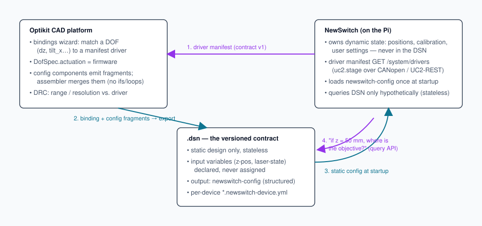

# Optikit ↔ NewSwitch — team discussion summary (Aug/Sep 2026)

Source: Zulip thread (Bene, Ethan, Christian, Johannes). Companion to
[OPTIKIT-INTEGRATION.md](OPTIKIT-INTEGRATION.md) and
[contracts/driver-manifest.v1.example.json](contracts/driver-manifest.v1.example.json).

## What the team converged on

1. **The .dsn is a stateless, versioned design contract.** It never stores
   dynamic values: no calibration, user settings, permissions, serial ports,
   init positions. Anything dynamic (stage z, laser on/off) appears only as a
   **declared input variable without a value**.
2. **NewSwitch owns real-world state** and queries the DSN *hypothetically*
   ("if z were 50 mm, where would the objective be?") through a stateless
   query API — a library or wasm worker on the Pi, a subset of the Optikit
   platform, not a second renderer.
3. **The static NewSwitch config is generated by the DSN.** Nonphysical
   config components each emit a fragment (structured maps, not stringified
   JSON); an assembler merges them into one `newswitch-config` output
   variable that NewSwitch reads once at startup. Templates stay dumb:
   variable interpolation only, **no ifs or loops** (Christian + Ethan, hard
   agreement).
4. **Variable binding is NewSwitch-owned schema.** The binding between a DSN
   input variable and a NewSwitch state variable is just another config
   fragment, conforming to a *versioned subspec* published by NewSwitch
   (reverse-domain style, e.g. `org.openuc2.driver.uc2-stage.v1`). Optikit
   never hardcodes NewSwitch's schema — Conway's law by design.
5. **Per-device specs live in per-device files** (`*.newswitch-device.yml`)
   referenced from the component's `static-models`, not embedded in Optikit's
   own schema. Optikit carries them as opaque files; NewSwitch parses them.

## Open points (not yet decided)

- **Version pinning**: Ethan — DSN pins openUC2 OS (and thus NewSwitch)
  as a total BOM; Johannes — DSN stands alone as the versioned artifact.
- **initPos**: Christian wants the design's nominal focus position in the
  DSN; Ethan says positions are calibration. Likely resolution: DSN may state
  a *nominal design target* (a design fact); NewSwitch converts it to a real
  move after homing.
- Where the component tech-spec database lives (git DB vs. DSN-bundled files).

## Your mental model, adjusted

> "newswitch creates an api file that we can use in optikit to match e.g. a
> linear stage with an interface, then reference it in the DSN and export it
> to be used in newswitch"

Correct, with one refinement of direction: NewSwitch publishes the **driver
manifest** (`GET /system/drivers`, vendored snapshot already in
`docs/contracts/`), the Optikit bindings wizard matches a **DOF ↔ driver**
and design-rule-checks it (range vs. `min_um/max_um`, resolution vs.
`steps_per_um`), the binding lands in the DSN as a config fragment, and the
*export* hands the assembled static config back. So it's one loop, not a
one-way file: manifest out → binding in → config back.

## Alignment with the code today

| Agreed concept | Already in code |
|---|---|
| DOF with firmware actuation | optikit-core: `DofSpec.actuation: manual\|optimizer\|firmware`, surface-bound tilts, kinematics table (WP-192/193) |
| Hypothetical stateless query | optikit-core: `/v1/scene3` takes `instantiation.dof_values` and returns posed geometry — GET semantics, no stored state |
| Transport naming (`control.canopen.motor.id.1`, `control.uc2rest…`) | newswitch DEV_BD: UC2 hardware bus with CANopen + UC2-REST transports (6dbe7c3), wave-1 controls (db9ebb0) |
| Config loaded at startup | newswitch DEV_BD: `NEWSWITCH_CONFIG` JSON loading (15a010a) |
| Driver contract | `docs/contracts/driver-manifest.v1.example.json` (schema drafted, endpoint not yet served) |
| Live firmware poke from the design | optikit-core schematic/assembly DOF sliders + ⚡ send (CAN object / UC2-REST device URL) |

## What this means for future development

1. **Serve the manifest for real.** Implement `GET /system/drivers` in
   NewSwitch from the vendored example; freeze it as `contract: v1`. Smallest
   step, unblocks the wizard's matching against a live device.
2. **Emit bindings as fragments, not ad-hoc.** The optikit-core wizard
   already writes `actuation: firmware`; next it should emit a config
   fragment conforming to the NewSwitch subspec instead of inventing keys.
3. **Don't build the config assembler in optikit-core.** Variables +
   expr-lang merging is Ethan's schema layer (DN 10); optikit-core sits on
   top of it (agreed in-thread: "Optikit-v2 is sitting on top of Ethan's
   schema"). Wait for his pose-model redo before deepening the export format.
4. **Purge pseudo-config.** Anything real-world-derived (COM ports → match
   `/dev/ttyACM*`; init positions → post-homing move) comes out of static
   config and into NewSwitch runtime logic. "ImSwitch treated a lot of stuff
   like config that wasn't config" is the anti-goal.
5. **One renderer/tracer.** The Pi-side query API should vendor optikit's
   materializer (library or wasm), not grow a parallel geometry engine.
